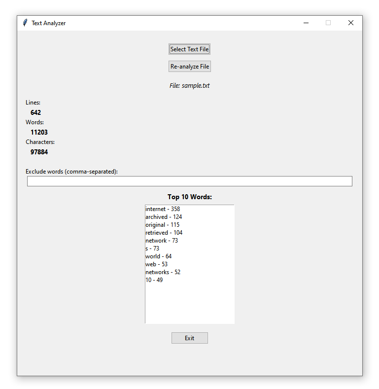

# 📝 Text Analyzer (Python + Tkinter)


## About the Project

Text Analyzer is a desktop application built with **Python** and **Tkinter** for analyzing text files.

The application reads a text file and displays basic statistics such as the number of lines, words, and characters. It also identifies the most frequently used words while allowing users to exclude common or custom words from the analysis.

## Screenshots

### Main Window



## Features

* Select and analyze `.txt` files.
* Count lines in a text file.
* Count words in a text file.
* Count characters in a text file.
* Display the top 10 most common words.
* Automatically exclude common English stop words.
* Add custom words to the exclusion list.
* Double-click a word to add it to the exclusion list.
* Re-analyze the file after changing excluded words.
* Support common text encodings including UTF-8, UTF-16, and Latin-1.
* Simple offline desktop interface.

## Technologies Used

* Python 3.7
* Tkinter
* Regular Expressions (`re`)
* Collections (`Counter`)
* pathlib

## Requirements

* Python **3.7**

No external packages are required.

## Project Structure

```text
text-analyzer-python/
├── text_analyzer.py
├── data/
│   └── sample.txt
├── screenshots/
│   └── main-window.png
├── requirements.txt
└── README.md
```

## Installation

1. Clone this repository.
2. Run the application:

```bash
python text_analyzer.py
```

3. Click **Select Text File**.
4. Choose a `.txt` file.
5. Review the text statistics and most common words.

## Sample Data

A `sample.txt` file is included in the `data/` folder for testing the application.

The sample text can be replaced with another `.txt` file to test the analyzer with different types of content.

## How It Works

The application reads the selected text file and:

1. Loads the text using a supported encoding.
2. Counts the number of lines and characters.
3. Extracts words from the text.
4. Removes default stop words.
5. Removes any custom excluded words entered by the user.
6. Calculates the 10 most frequently used remaining words.
7. Displays the results in the application.

## Future Improvements

* Add sentence counting.
* Add average word length.
* Add reading-time estimation.
* Add a word-frequency chart.
* Add support for additional file formats.
* Add text search and highlighting.
* Add an option to export analysis results.
